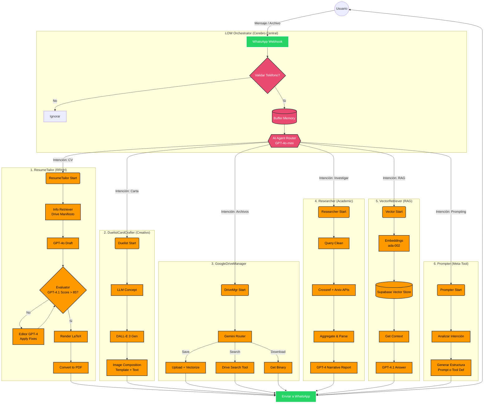

# LOW: Life Organizer & Work-assistant 🤖

LOW es un **Agente de Inteligencia Artificial Orquestador** construido sobre **n8n**. Funciona como un asistente personal integral que opera a través de WhatsApp, capaz de gestionar tareas complejas mediante el uso de herramientas especializadas (Sub-agentes).

## 🚀 Características Principales

LOW no es un simple chatbot; es un enrutador inteligente que decide qué herramienta usar según la intención del usuario:

## 📂 Flujos de Trabajo (Workflows)

El sistema se compone de 7 flujos interconectados en n8n:

1.  **LOW (Orchestrator):** El cerebro central que gestiona WhatsApp y enruta las peticiones.
2.  **ResumeTailor:** Agente especializado en crear y optimizar CVs con LaTeX.
3.  **DuelistCardCrafter:** Generador de arte y cartas coleccionables con IA.
4.  **Researcher:** Buscador de papers académicos en Arxiv y Crossref.
5.  **GoogleDriveManager:** Gestor de archivos (subida/bajada) con indexación vectorial.
6.  **VectorRetriever:** Sistema RAG para consultas sobre la base de conocimiento propia.
7.  **Prompter:** Asistente para crear prompts y definiciones de herramientas de IA.

## 🛠️ Stack Tecnológico

*   **Core:** n8n (Workflow Automation).
*   **Modelos:** GPT-4o, GPT-4o-mini, DALL-E 3, text-embedding-ada-002.
*   **Database:** Supabase (Vector Store).
*   **Interface:** WhatsApp Business API.
*   **Integraciones:** Google Drive, Google Docs/Sheets.

## 📂 Estructura del Proyecto

Este repositorio contiene los flujos JSON para importar en n8n. Revisa la carpeta `/documentation` para detalles profundos de cada agente.

---
