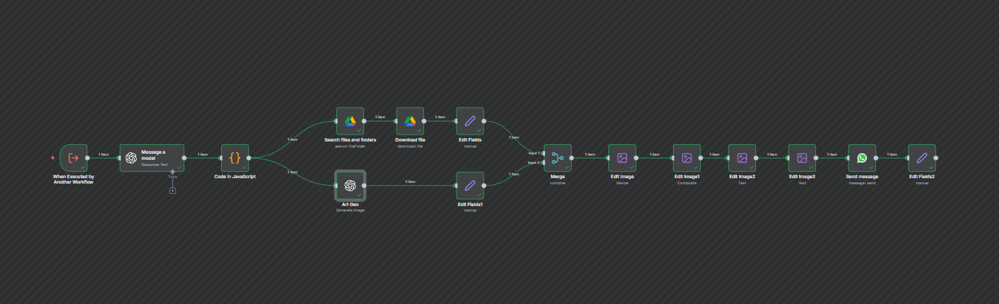

# DuelistCardCrafter: Motor Creativo Multimodal

**Archivo:** `DuelistCardCrafter.json`

## Descripción
Un agente diseñado para la creatividad lúdica. Transforma conceptos abstractos (teorías, sentimientos, objetos) en cartas coleccionables de estilo TCG (Trading Card Game) con arte y texto generados por IA.

## Flujo de Trabajo

1.  **Conceptualización (LLM):** Recibe un tema (ej. "Ecuación de Schrödinger") y genera un JSON con:
    *   Título temático.
    *   Descripción del efecto de la carta.
    *   Prompt artístico detallado para la generación de imagen.
2.  **Generación de Arte (DALL-E 3):** Crea una ilustración basada en el prompt visual generado.
3.  **Búsqueda de Assets:** Descarga una plantilla (marco de carta) desde Google Drive.
4.  **Procesamiento de Imagen:** Utiliza nodos de edición gráfica para:
    *   Redimensionar el arte generado.
    *   Componer (superponer) el arte sobre la plantilla.
    *   Escribir el texto del título y la descripción sobre la imagen final.
5.  **Entrega:** Envía la imagen compuesta final (`.jpg`) al chat de WhatsApp.