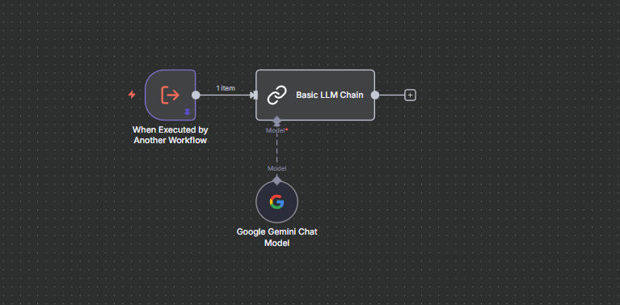

# Prompter: Generador de Estructuras de IA

**Archivo:** `prompter.json`

## Descripción
Una meta-herramienta diseñada para ayudar al usuario a construir *otros* agentes o prompts. Transforma solicitudes vagas en definiciones técnicas estructuradas.

## Flujo de Trabajo

1.  **Análisis de Solicitud (Basic LLM Chain):** Un modelo LLM analiza qué necesita el usuario:
    *   ¿Un System Prompt optimizado?
    *   ¿Una definición de herramienta (Tool Definition) para un agente?
2.  **Generación Estructurada:**
    *   Si es un **Prompt**: Genera la estructura `[BEGIN PROMPT] ... [END PROMPT]` con rol, objetivo, restricciones y formato.
    *   Si es una **Herramienta**: Genera el esquema JSON o YAML con nombre, descripción, inputs y outputs requeridos.
3.  **Refinamiento:** Usa modelos de Google Gemini y OpenAI para asegurar que la estructura técnica sea correcta y utilizable en sistemas como LangChain o n8n.
4.  **Entrega:** Envía el bloque de código listo para copiar y pegar por WhatsApp.